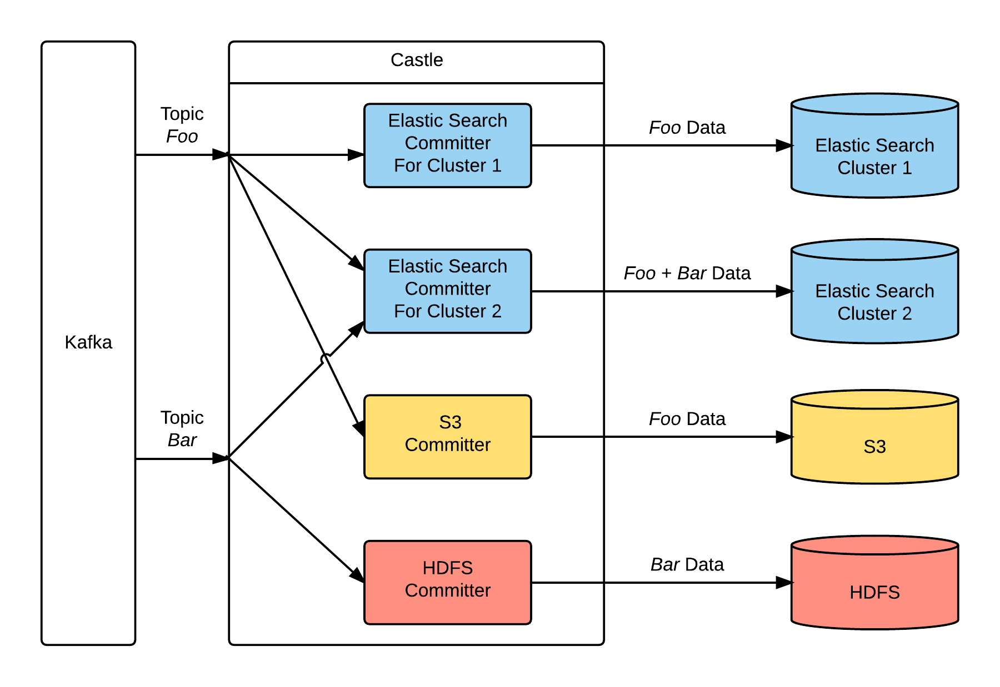

# Preface
A lot has changed since Castle was written. You may want to look into [Kafka Streams](http://docs.confluent.io/current/streams/index.html) and [Kafka Connect](http://docs.confluent.io/2.0.0/connect/) as alternatives to Castle.

# What is Castle?
Castle is a Scala framework that executes plugins called Committers which consume data from Kafka and write the data to some other destination.  At [Box](https://www.box.com/), we use Kafka as the central queuing component for a number of our data streams. Kafka serves as the buffer that can take on traffic bursts that might otherwise overwhelm downstream components. It also allows for flexibility with how we process and consume the data from multiple sources. Getting vast amounts of data into Kafka is easy. However, getting the data out in order to transform it and move it somewhere else is not as straightforward. Performing this operation in a robust manner ends up being a deceptively difficult problem with multiple gotchas that must be solved time and again by the code that is performing this consumption. This is where the Castle framework comes in. It allows engineers to write Committers that focus solely on data processing because the framework guarantees at least once delivery of all the messages in a Kafka stream to the committer code, which then has the sole responsibility of getting the messages to their final destination.

The Castle framework takes care of the following:
- at least once delivery of messages to committer code

- cluster definition and expansion / shrinking

- nodes going down and going back up

- task assignment

- position tracking in the source stream

- retrieving data efficiently

- easy debugging/configuration

- retry logic for transient failures

- continuous operation to get the latest data from the stream

- reduction of read traffic against Kafka via stream sharing between different committers

- handling changes in Kafka topics and partitions

- handling Kafka brokers going down

- support for targeting a specific batch size (helpful if you want to write larger files)

- providing observability by emitting metrics about itself as well as fundamental metrics that are pertinent to all committers 

- allowing you to tune parallelism of your committer instances as a function of the number of partitions that a Kafka topic has.  For example, if a Kafka topic has N partitions, you can chose to run 4N instances of your committer if it is compute heavy and needs to be distributed across more Castle nodes but the stream itself is not heavy enough to justify that many partitions within Kafka, or you have other Committers that are tuned to N partitions

Each Committer can be configured so it consumes a specific set of topics from Kafka, and there can be multiple instances of the same Committer configured in different ways. A simplified diagram of a running Castle process looks like this:

In this diagram, we have three different types of committers: **Elastic Search**, **S3**, and **HDFS** consuming data from the _Foo_ and _Bar_ topics.  However, for the **ES Committer**, we have configured two separate instances.  The first **ES Committer** is configured to only consume the _Foo_ topic and writes it to ES Cluster 1. The second **ES Committer** is configured to consume data from both the _Foo_ and _Bar_ topics and writes the data to ES Cluster 2.

## Support

Need to contact us directly? Email oss@box.com and be sure to include the name of this project in the subject.

## Copyright and License

Copyright 2015 Box, Inc. All rights reserved.

Licensed under the Apache License, Version 2.0 (the "License");
you may not use this file except in compliance with the License.
You may obtain a copy of the License at

   http://www.apache.org/licenses/LICENSE-2.0

Unless required by applicable law or agreed to in writing, software
distributed under the License is distributed on an "AS IS" BASIS,
WITHOUT WARRANTIES OR CONDITIONS OF ANY KIND, either express or implied.
See the License for the specific language governing permissions and
limitations under the License.
